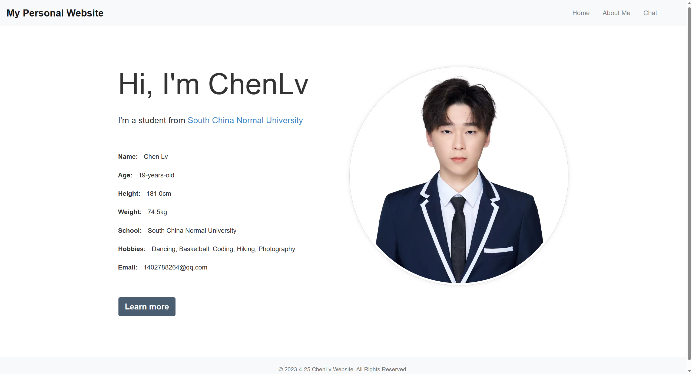
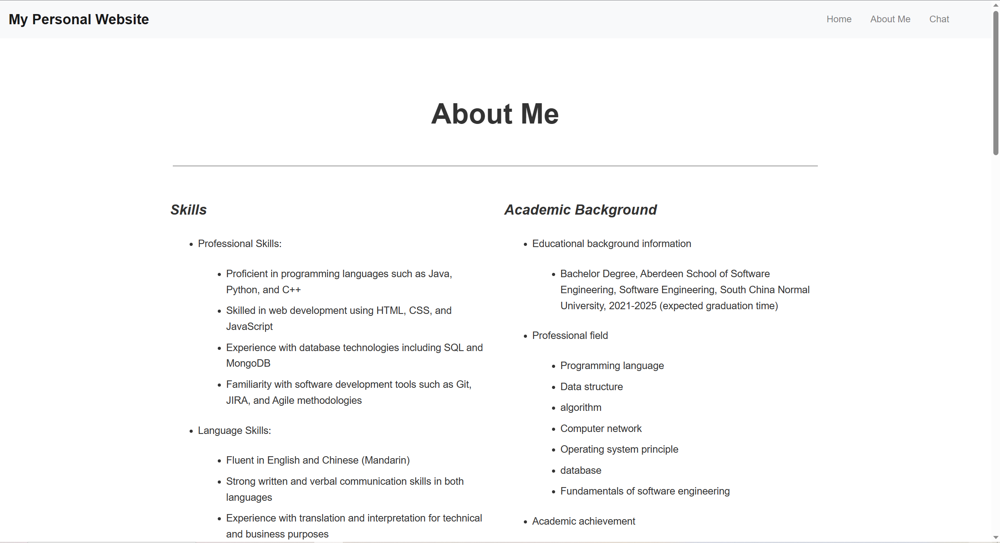
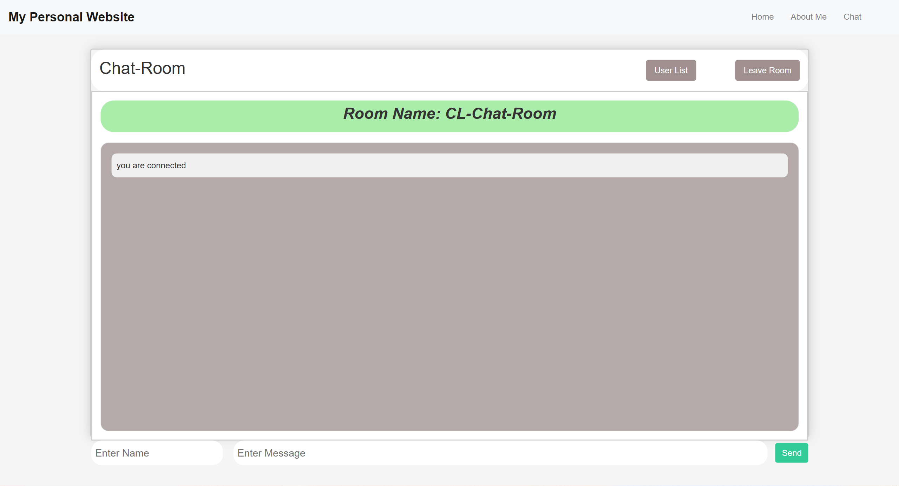

i## Chat-app
>### Project introduction
&nbsp;&nbsp;&nbsp;Chat is a simple and practical chat room application developed based on Node.js and WebSocket technologies, using Express.js framework to build servers and routes, Bootstrap provides basic UI components and styles, and jQuery for DOM manipulation and event binding.

&nbsp;&nbsp;&nbsp;In the chat room application, users can enter nicknames and send text messages, emoticons and pictures. Also, the chat room supports message history viewing, where you can scroll to the bottom of the page and see all past messages. In addition, we provide a simple user interface design to make it easier for users to use the chat room application.

>### Functional characteristics

- Support simultaneous online chat for multiple users
- Yes Users can send their own names as well as text messages
- Can accept names and messages sent by other users
- Real-time communication: Supports real-time chat, online user list, message reminder, and other functions.
- The application displays notifications to existing users when a new user joins
- When the user exits, the application displays a notification to other users
- View message history
- Allows users to enter nicknames


>### __How to use__

&nbsp;&nbsp;&nbsp;1. __Download the source code locally__

```bash
$ git clone https://github.com/superman1006/Chat.git
```
&nbsp;&nbsp;&nbsp;2. __Installation dependency__
```bash
$ cd chat/chat-app
$ npm install
```
&nbsp;&nbsp;&nbsp;3. __Start server__
```bash
$ npm start
```
&nbsp;&nbsp;&nbsp;4.__Access application__

&nbsp;&nbsp;&nbsp;__1.__ Start with Visual Studio Code and open a browser ,you can type http://localhost:3000, and you will see the details of the website.

&nbsp;&nbsp;&nbsp;__2.__ If running in Codio, you can directly click the Box URL button on the upper right or type https://othellorichard-pressletter-3000.codio-box.uk/ in your browser to browse the page details.


>### __Technology stack__

__1.front：__
 - HTML
 - CSS
 - JavaScript
 - Bootstrap
 - jQuery
 - Socket.io client

__2.back：__
 - Node.js
 - WebSocket
 - Express.js
 - Socket.io server

>### Challenges faced during the website development process

__Introduction and About page：__

- Page design and style layout: In the process of web development, it is necessary to consider the design and style layout of the page, which requires a certain creativity and design ability.
- Responsive Web Design: Responsive web design is an important task to ensure that the web page can be adapted to different devices and screen sizes to improve the user experience.
- Browser compatibility: The same web page may display differently on different browsers. Therefore, you need to consider how to resolve compatibility problems.
- Code writing: Writing code requires some programming knowledge and skills, and requires an understanding of the syntax rules of HTML, CSS, and JavaScript and how they interact.
- Debugging and testing: In the process of web development, it is necessary to constantly debug and test to ensure the correct function and style of the web page.

__Chat-NodeJS chat room：__

- Server side development: chat room is an application that needs server side support. It needs to set up the server, write back-end code and deal with various network communication protocols.
- Real-time communication: Chat rooms require real-time communication, which requires the use of WebSocket or other real-time communication technology to achieve.
- User authentication and management: Users in the chat room need to be authenticated and managed, including login, exit, and permission management.

&nbsp;&nbsp;&nbsp;&nbsp;In short, the development of web pages and chat rooms requires a wide range of knowledge and skills, including front-end and back-end development, network communication, security and other aspects, which requires continuous learning and improving skill levels.

>### Communication between chat application clients and servers
&nbsp;&nbsp;&nbsp;&nbsp; __1.__ This is done through the WebSocket protocol, a standardized technique for establishing persistent connections between Web applications and servers. After the connection is established, the client and server can carry out two-way data transmission on a separate connection, which makes real-time communication possible.

&nbsp;&nbsp;&nbsp;&nbsp; __2.__ In the client-side code of the chat application, I use client-side JavaScript apis such as Socket.IO or the native WebSocket API to create WebSocket connections and communicate with the server. The client sends the chat message to the server by sending specific message events (for example, 'chat message'), and the server listens for these events and broadcasts the received message to all connected clients.

&nbsp;&nbsp;&nbsp;&nbsp; __3.__ Similarly, clients can receive messages sent by other users by listening for message events sent by the server (for example, 'chat message'). The client can use the JavaScript API to dynamically update the message list in the chat window to display new chat messages.

>### Event handling and using web sockets
&nbsp;&nbsp;&nbsp;&nbsp; __1.__ In my chat application, using WebSockets allows my application to transfer messages in real time. Using WebSockets, you can establish a persistent connection between client and server and enable both parties to send messages immediately. WebSockets are part of the HTML5 standard, so modern browsers support them.

&nbsp;&nbsp;&nbsp;&nbsp; __2.__ When implementing WebSocket, you can use Node.js' socket.io library. The socket.io library provides a simple interface for creating WebSocket connections, handling connection events, and sending and receiving messages. On the client side, you can use JavaScript code to listen for message events and update the chat interface to display new messages. On the server side, you can use the socket.io library to listen for connection events and process messages to broadcast new messages to other clients.

&nbsp;&nbsp;&nbsp;&nbsp; __3.__ In addition, on the event side, you can use JavaScript event listeners to capture user actions, such as clicking buttons, submitting forms, and so on. By adding appropriate event listeners, you can trigger actions when the user performs them.

&nbsp;&nbsp;&nbsp;&nbsp; __4.__ For example, in your chat application, you can use event listeners to handle events when a user submits a message. When a user submits a chat message, you can use JavaScript code to capture the form submission event and send the message to the server using the socket.io library. The server can then broadcast the message to all connected clients to update the chat interface and display the new message.

&nbsp;&nbsp;&nbsp;&nbsp; __5.__ Overall, using event listeners and WebSockets allows your chat application to update messages in real time, providing a better user experience.

>### __Web screen__

### Introduction page
(After starting the server, you can view the following picture)
<!--  -->
<div align = "center"></img>
</div>
__1.Navigation bar__
&nbsp;&nbsp;&nbsp;&nbsp;A fixed navigation bar at the top of a web page that contains links to Home, About Me, and Chat for jumping to different pages.

__2.Introduction Section__
&nbsp;&nbsp;&nbsp;&nbsp;Mainly introduce my personal information and hobbies. Include your name, age, height, weight, school, hobbies, and email address.

__3.Footer Section__
&nbsp;&nbsp;&nbsp;&nbsp;Fixed copyright information at the bottom of the page, including the website name and copyright notice.

__4.Adaptive layout__
&nbsp;&nbsp;&nbsp;&nbsp;Developed using the Bootstrap framework to support adaptive layout of different screen sizes.

__5.Interactive animation__
&nbsp;&nbsp;&nbsp;&nbsp;In the Introduction Section, a number of interactive animations are used, such as text gradually appearing, pictures gradually enlarging, etc., to improve the visual effect of the web page.

&nbsp;&nbsp;&nbsp;&nbsp;Overall, the page displays my personal information and hobbies and provides links to other pages through a simple and clear design.

### About page
(After starting the server, you can view the following picture)
<!--  -->
<div align = "center"></img>
</div>

__1.Page header：__
&nbsp;&nbsp;&nbsp;&nbsp;Contains a site titled "About Me" that uses the Bootstrap CSS framework, as well as a custom CSS stylesheet. The page also contains three navigation links: Home, About Me, and Chat. These links allow you to navigate between pages.

__2.About Me Section：__

&nbsp;&nbsp;&nbsp;&nbsp;This section describes the author's skills and academic background. The Skills section is divided into five sub-sections: professional skills, Language skills, computer skills, communication skills and management skills, each of which is described in detail. The Academic Background section introduces the author's educational background, including information on degree, field of specialization, course programs, research projects and academic achievements.

 __3.The details of the Skills section are as follows：__

&nbsp;&nbsp;1.Professional Skills: Introduces my proficiency in programming languages such as Java, Python and C++, as well as Web development techniques such as HTML, CSS and JavaScript, database techniques such as SQL and MongoDB, and software development tools such as Git, JIRA and Agile methods.
&nbsp;&nbsp;2.Language Skills: This describes my fluency in English and Chinese (Mandarin) and oral and written communication skills, as well as technical and business translation and interpretation experience.
&nbsp;&nbsp;3.Computer skills: Introduces the author's proficiency with Windows and Linux operating systems, as well as computer hardware and network concepts

### Chat page
(After starting the server, you can view the following picture)
<!--  -->
<div align = "center"></img>
</div>

&nbsp;&nbsp;&nbsp;&nbsp; After clicking the Chat option, the page jumps to the chat room page, which is divided into three parts: the chat room title, chat history display area and chat input area.

__1.__ chatroom title Displays the chatroom name as "CL-Chat-Room".

__2.__ Chat Records Display area displays chat records in the form of bubbles. On the left side, names of chat room members are displayed. On the right side, chat messages sent by chat room members are displayed.

__3.__ The chat input field contains a text field for entering names, a text field for entering messages, and a send button.

__4.__ After clicking the send button, the input name and message will be sent to the server through the emit function of the socket.io library.

__5.__ has a User List button in the upper right corner, which can be clicked to send a request to the server for a list of users in the chat room.

__6.__ After clicking the Leave Room button, it hides the name and message input box and the send button, and sends the server a message that the user has left the chat room.

__7.__ When a user leaves the room, a message is broadcast to other users connected to the room.

__8.__ When a user closes a web page, a disconnection message is sent to the server.
The page was beautified using Bootstrap and custom CSS styles.


>### Reference source
 - Mozilla Developer Network: https://developer.mozilla.org/
 - W3Schools: https://www.w3schools.com/
 - Bootstrap Documentation: https://getbootstrap.com/docs/5.0/ - getting-started/introduction/
 - Node.js Documentation: https://nodejs.org/en/docs/
 - Socket.IO Documentation: https://socket.io/docs/v4/
 - MDN WebSockets API: https://developer.mozilla.org/en-US/docs/Web/API/WebSockets_API

>### Author
&nbsp;&nbsp;&nbsp;&nbsp;&nbsp;___Chen-Lv___
&nbsp;&nbsp;&nbsp;&nbsp;&nbsp;Github:___superman1006___

>### License
The project follows an MIT license that allows you to use, copy, modify, merge, distribute, distribute, sublicense, or sell copies of the software without restriction.

